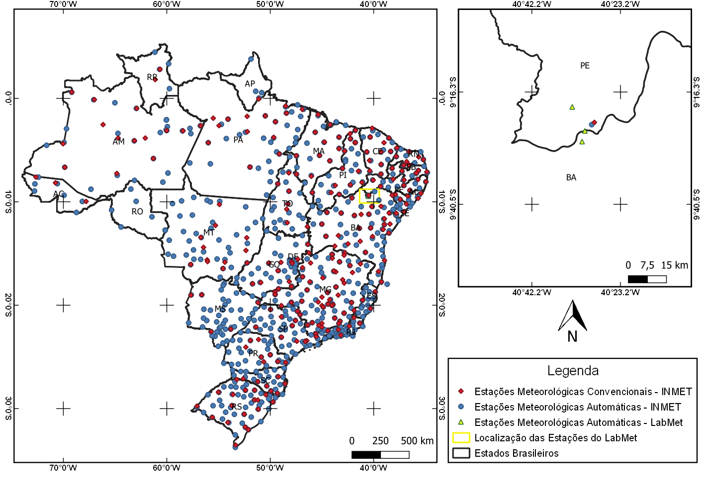
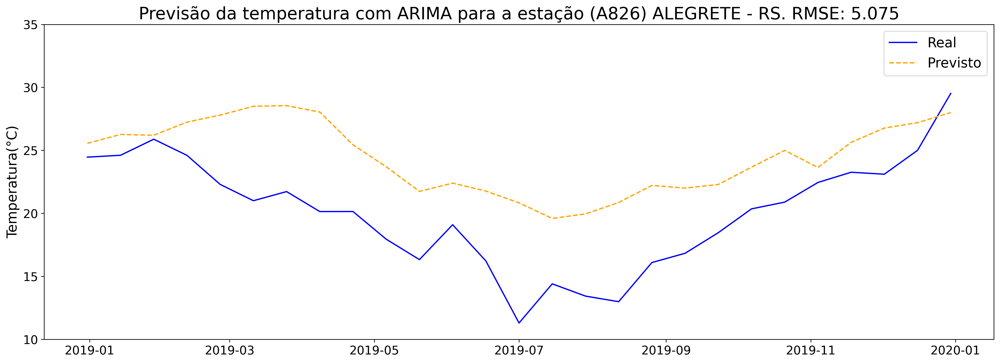
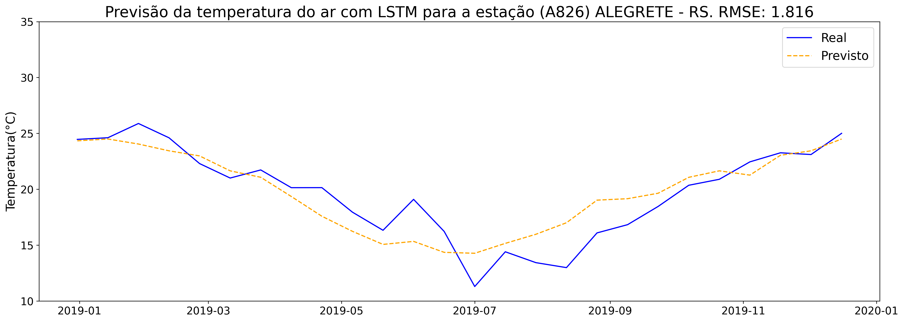

## Título: Previsão da Temperatura do Ar no Brasil Utilizando Estações Meteorológicas e Modelos de Aprendizado de Máquina¶

## Documentos: 

* [Relatório](https://github.com/saraivaufc/TCC-Ciencia-de-Dados/blob/master/3_relatorio/relatorio.pdf)

* [Apresentação](https://github.com/saraivaufc/TCC-Ciencia-de-Dados/blob/master/4_apresentacao/apresentacao.pdf)

## Conjunto de dados utilizados

* [Estações Meteorológicas Convencionais do INMET (1961-2019)](https://www.kaggle.com/saraivaufc/conventional-weather-stations-brazil) 
* [Estações Meteorológicas Automáticas do INMET (2000-2019)](https://www.kaggle.com/saraivaufc/automatic-weather-stations-brazil) 
* [Estações Meteorológicas Automáticas do LabMet (2007-2020)](https://www.kaggle.com/saraivaufc/automatic-weather-stations-labmet) 

## Configuração do ambiente de execução

Você pode configurar um ambiente local com Hadoop e Spark utilizando o Docker disponível em: https://github.com/saraivaufc/bigdata-docker

## Figuras

